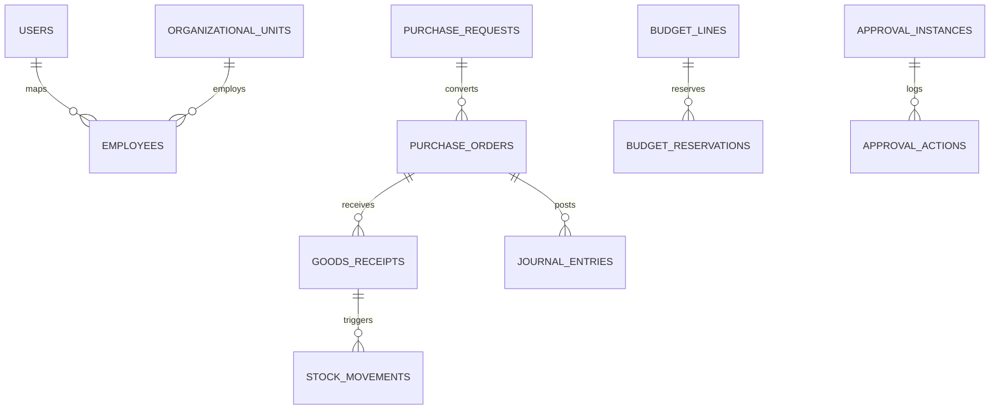

# Entity Relationship Diagram — SQ+

## Konvensi

- Semua tabel transaksional memiliki: `id`, `created_at`, `updated_at`, `created_by`, `updated_by`
- Soft delete (`deleted_at`) untuk master data
- Pola penomoran via `NumberingService`

## Domain: Foundation

```
users ──┬── user_roles ── roles ── role_permissions ── permissions
        └── user_units ── organizational_units

audit_logs (user_id, action, entity_type, entity_id, metadata)
documents (entity_type, entity_id, file_path, version)
notifications (user_id, title, body, read_at, payload)
```

## Domain: Keuangan

```
chart_of_accounts
fiscal_years ── budget_headers ── budget_lines
journal_entries ── journal_entry_lines (account_id, debit, credit)
cash_accounts ── cash_transactions
```

## Domain: Personalia

```
employees (user_id?, employee_code, name, legacy_department_code?, organizational_unit_id, position_id, employment_status, source_system?)
positions ── organizational_units
attendance_records (employee_id, date, check_in, check_out)
leave_requests (employee_id, type, start_date, end_date, status)
payroll_periods ── payroll_items (employee_id, components...)
```

## Domain: Pengadaan

```
vendors
purchase_requests ── pr_lines (item_id, qty, estimated_price)
purchase_orders ── po_lines
goods_receipts ── grn_lines
```

## Domain: Supply Chain

```
items (sku, name, uom, category)
warehouses
stock_balances (item_id, warehouse_id, qty_on_hand)
stock_movements (item_id, warehouse_id, qty, type, reference)
fixed_assets (item_id?, acquisition_cost, depreciation_method)
```

## Domain: Workflow

```
approval_flows (document_type, steps JSON)
approval_instances (document_type, document_id, status, current_step)
approval_actions (instance_id, user_id, action, note, acted_at)
```

## Relasi Lintas Modul (Kunci)

| Dari | Ke | Relasi |
|------|-----|--------|
| PO | Budget Line | reservasi anggaran |
| GRN | Stock Movement | increment stok |
| GRN / Invoice | Journal Entry | posting akuntansi |
| PR / PO / Leave | Approval Instance | workflow |
| Semua transaksi | Audit Log | jejak audit |

## Diagram Ringkas



> Detail skema SQL akan dikembangkan di `database/migrations/` pada fase implementasi.
